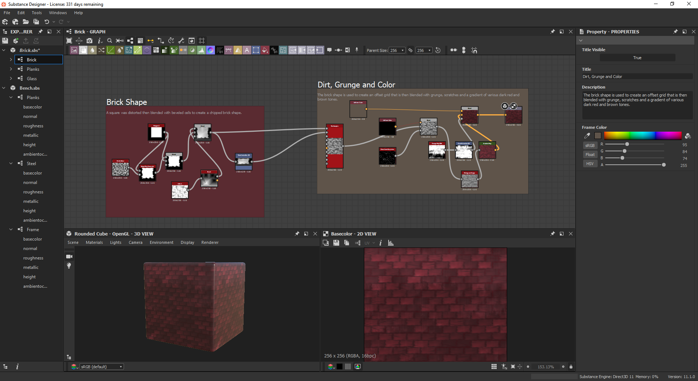
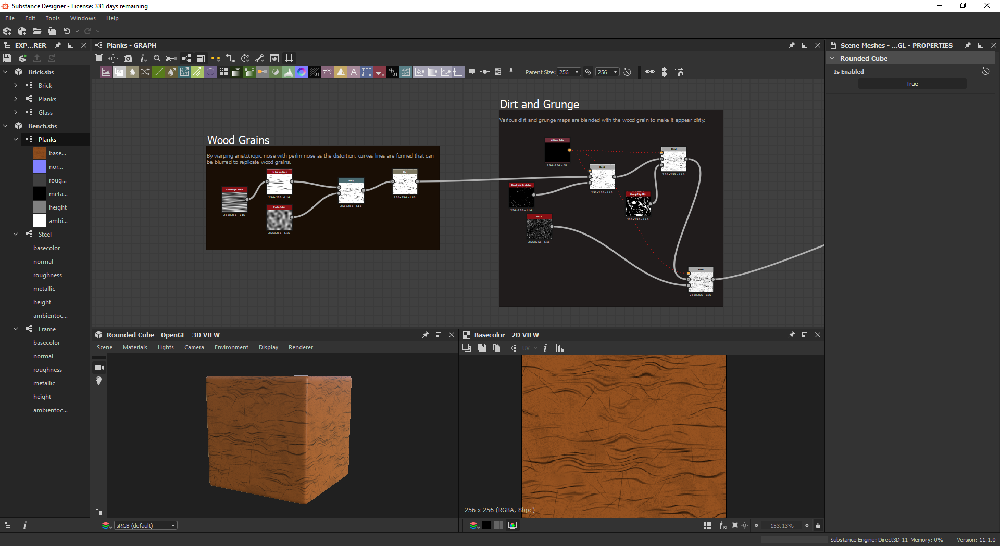
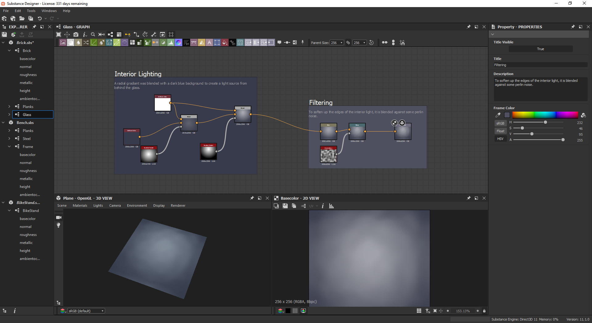
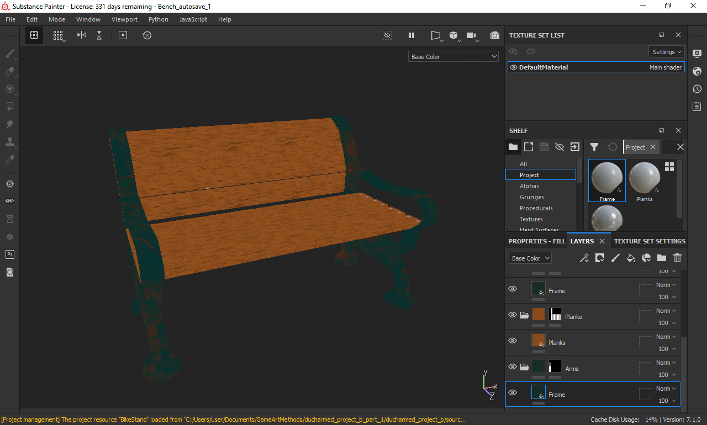

# Procedural Stylized Materials

## Overview

While taking the Game Art Methods graduate course at Savannah College of Art and Design, I was tasked with creating a collection of game assets that could be used to create an environment. For my project, I chose to make an environment for a mobile game that used procedurally-generated stylized textures to push more with little geometry.

## Process

### Art Style

The style I chose to replicate was stylized mobile assets that primarily rely on diffuse maps to carry the detail. Due to the limitations of mobile device performance, the assets need to be optimized in geometry count and texture size. 

The primary goal of designing the materials then was to manipulate the shapes provided from some of Substance Designer's built-in nodes to create forms and detail that match this aesthetic. Just coloring the surfaces would not be enough; additional details such as grunge, scratches, smudges and fake lighting all needed to be done with nodes.

### Creating the Materials

The basic principle behind each material is that various maps are distorted and blended together to form the basic shapes that become the details in our diffuse map. The `Brick` material is the first example of this; the material consists of a square that is distorted then put into an offset grid where the entire wall pattern is given additional detail.

The small, distorted rectangles that make up each individual brick in the overall `Brick` material are created by taking a square and blending it with a `Scope Blue Grayscale` with a modified `Perlin Noise` node to create the chipped edges of each brick. This is then blended again with a `Bevel` node which uses a modified `Cells 1` node to create cracks and chips in the interior of each brick. This shape is then passed into the `Pattern Input` input of the `Tile Sampler` node and blended with `Directional Scratches`, `Grunge Map 005` and a `Gradient Map` mode containing various shades of the red brick tone that makes the bricks look like they are damaged, have dirt on them and are of the color one would expect bricks to be.

Another example of this methodology applied to creating a diffuse map is with the `Planks` material. The grains were created by warping `Anistotropic Noise` with `Perlin Noise` as the distortion which created curves lines are formed that can be then blurred to smooth out the shape. These created shapes are then blended with `Dirt 1`, `Directional Scratches` and `Grunge Map 004` to make the planks feel worn and used which is then further blended with the light and dark colors of the wood to create the final aesthetic.

The `Glass` material presented an interesting challenge because there would be no reflections or specularity in the environment to help see through. As such, I blended two `Radial Gradient` nodes against a dark blue, the first once creating the shadows in the corners of the windows and the second creating the interior light. This is then further blended with a `Perlin Noise` node to blur the light and made the window look a big smudged.

### Applying Them to Models

The primary process I used to apply these materials to objects was to bring them into Substance Painter and use their system of masks to apply the materials to various sections of the model. In the case of the bench, for example, the `Planks` and `Frame` materials were applied to each of their respective sections to make the bench look as if it has a wooden seat and a rusted metal frame. The material was scaled in the editor such that each of the planks would have their own unique scratches and scuffs.

### Into the Engine *(In Progress)*

*Note: The following section is in progress and will be formally completed after the graduate review at Savannah College of Art and Design.*

# Reflections

Substance Designer is a powerful tool for creating tool for creating materials procedurally using nodes. Coming into this course with a programming background, I found traditional texturing methods via Photoshop or other raster graphics editors were difficult for me to wrap my head around and composite in the ways I wanted it to be. By being able to create materials using node-based scripting, I was able to leverage my skills as a programmer to create artistic materials that were visually-appealing and matched the intended style.

Moving forward, I am less interested in doing more node-based shader programming so much as I am more interested in programming plugins for Substance Designer/Painter. As I was using the programs, I discovered that plugins could be created using Qt, a UI framework I am familiar with. I may dabble in plugin development for these tools in the future leveraging my C++ and Qt experience after I used Qt to make other projects.